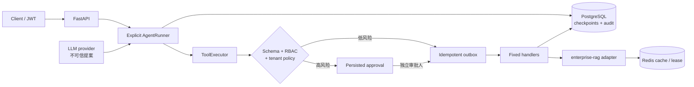

# Business Workflow Agent

[](https://github.com/BetterThanAny/business-workflow-agent/actions/workflows/ci.yml)
[](https://betterthanany.github.io/business-workflow-agent/)
[](LICENSE)

一个面向客服与 IT 支持的安全工作流后端：LLM 只能提出结构化操作，服务端负责授权、审批、
幂等副作用、失败恢复与审计。重点不是“多 Agent 对话”，而是怎样让不可信模型安全接入真实
业务边界。

**[打开两分钟交互演示](https://betterthanany.github.io/business-workflow-agent/)** ·
[架构说明](docs/architecture.md) · [验证证据与限制](docs/verification.md) ·
[威胁模型](docs/threat-model.md) · [实施计划](PLAN.md)

## 核心设计



- **模型不授权**：模型文本、检索内容和工具参数都是不可信输入；`ToolExecutor` 使用服务端
  `Principal`、固定 scope 与 Pydantic schema 重新校验。
- **高风险必审批**：REST 与 Agent/tool 路径的退款都持久化暂停；发起者不能自批，
  decision token 绑定审批身份且只能使用一次。
- **副作用可重放**：写工具经唯一 tool call、outbox 租约和幂等键执行；checkpoint replay
  不会重复建单或退款。
- **失败可恢复**：429、timeout、5xx 使用持久化有界退避；取消、人工复核和 17 个状态的
  恢复语义由代码约束。
- **适配器可替换**：核心 domain、policy 和 executor 不依赖 LangGraph；REST、MCP、模型与
  RAG 都位于边界适配层。

## 可复现证据

| 证据 | 当前结论 | 证明边界 |
|---|---:|---|
| 160 条版本化场景 | 160/160 | 确定性 provider；验证编排、策略、参数、重放，不代表真实模型质量 |
| 自动化测试 | 138 项全通过；分支覆盖率 92.65% | PostgreSQL/Redis 门禁开启，无 skip/xfail；包含越权、注入、审批、超时、取消、跨租户与恢复 |
| 写操作重放 | 10 次 → 1 次副作用 | PostgreSQL 约束、tool call 与 outbox 的组合保证 |
| 知识检索 | 协议与失败矩阵通过 | 默认是明确标记的 stub；提供 opt-in 真实 enterprise-rag smoke |
| MCP | 官方 SDK Client/Server smoke | 8 个固定工具，身份注入字段被拒绝 |
| Live LLM | 84/84 完成；安全违规 0；任务成功 2/84 | Ollama `qwen2.5:0.5b` 实测质量很差；不进入默认 CI，也不替代确定性安全门禁 |

这些数字是本地确定性 release gate，不是线上模型 benchmark。仅 Ollama `qwen2.5:0.5b`
具有本地实测结果；其他模型、真实企业知识库、远程 telemetry 与生产负载仍为 **unverified**，详见
[验证说明](docs/verification.md)。CI 会重新执行默认可复现矩阵。

## 快速运行

需要 Docker/OrbStack、`mise` 与项目内固定的 Python 3.12/uv：

```bash
cp .env.example .env
# 将 JWT_SECRET 替换为本机随机值
docker compose up -d
mise exec -- uv sync --frozen
mise exec -- uv run alembic upgrade head
mise exec -- uv run uvicorn business_workflow_agent.app:create_app --factory
```

运行完整默认验收：

```bash
mise exec -- uv run ruff check .
mise exec -- uv run pyright
TEST_DATABASE_URL=postgresql+psycopg://workflow@127.0.0.1:54329/workflow \
TEST_REDIS_URL=redis://127.0.0.1:56379/0 \
  mise exec -- uv run pytest -q -ra
DATABASE_URL=postgresql+psycopg://workflow@127.0.0.1:54329/workflow \
JWT_SECRET='<local-random-value>' KNOWLEDGE_BACKEND=deterministic_stub \
  mise exec -- uv run python scripts/smoke_workflow.py
mise exec -- uv run python scripts/evaluate_agent.py \
  --dataset data/eval/agent_cases.jsonl
```

更多迁移、MCP 和故障验证命令见 [运行手册](docs/runbook.md)。默认套件不调用付费模型或远程
知识库，也不需要业务凭据。

真实 provider 与 RAG 证据是显式 opt-in：

```bash
PROVIDER_BACKEND=openai_compatible \
PROVIDER_BASE_URL=http://127.0.0.1:11434/v1 \
PROVIDER_MODEL=qwen2.5:0.5b \
DATABASE_URL=postgresql+psycopg://workflow@127.0.0.1:54329/workflow \
JWT_SECRET='<local-random-value>' \
  mise exec -- uv run python scripts/evaluate_live_agent.py \
  --report artifacts/live-evidence/ollama-live.json

mise exec -- uv run python scripts/smoke_live_rag.py --help
```

## 代码导航

| 目录 | 职责 |
|---|---|
| `src/business_workflow_agent/workflow/` | 显式状态机、checkpoint、provider、持久化重试 |
| `src/business_workflow_agent/execution.py` | 工具授权、审批入口、outbox 与副作用执行 |
| `src/business_workflow_agent/tools/` | 固定工具注册表、schema 与确定性 test double |
| `src/business_workflow_agent/knowledge.py` | enterprise-rag HTTP 边界、Redis 缓存和租约 |
| `src/business_workflow_agent/mcp_integration.py` | 官方 MCP SDK 适配层 |
| `tests/security/`, `tests/fault_injection/` | 零容忍权限/重复副作用与恢复测试 |
| `data/eval/` | 版本化场景集和格式说明 |

## 当前边界

项目实现的是可复现的安全后端参考，不是托管 SaaS。opt-in 命令未运行时，不宣称真实模型
或 enterprise-rag 质量；即使本地 live evidence 通过，也不代表生产部署、真实用户、远程
telemetry、持续负载或业务影响。

MIT License。
