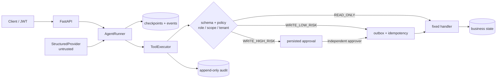
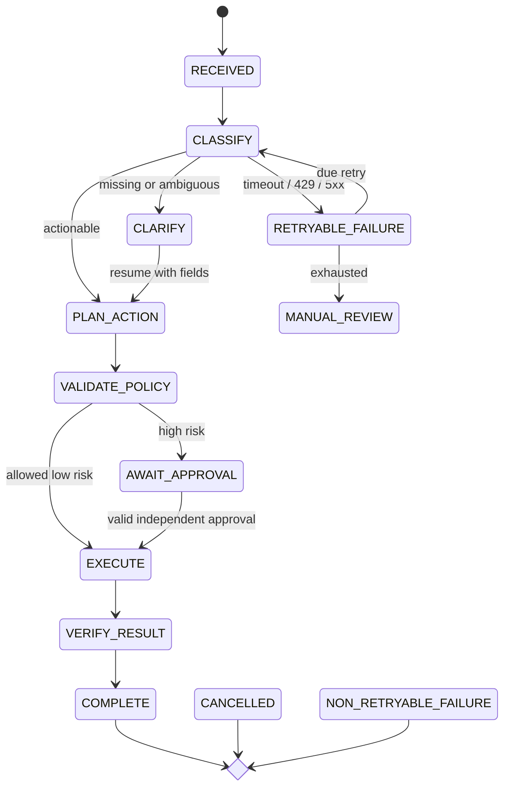
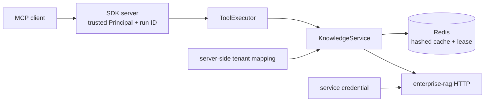

# Architecture

## Trust boundary

The provider can only return a structured proposal. `AgentRunner` persists explicit transitions and
sends registered proposals to `ToolExecutor`. The executor re-validates the fixed Pydantic schema and
authorizes the authenticated server-side `Principal`; model text, context, retrieved text and proposed
arguments never become authority.

Core domain, policy, schemas and execution are framework-independent. OpenTelemetry and Prometheus
are injected through `WorkflowTelemetry`, so exporters can change without altering authorization or
state semantics.

## State and recovery

Every transition increments a stable run version and persists a checkpoint in the same transaction.
Retries persist their due time rather than sleeping in a request. Write calls are uniquely recorded;
outbox leases can be reclaimed after process death, while completed calls cannot execute twice.

## MCP and knowledge boundary

MCP exports the same fixed schemas as REST. Business arguments cannot inject a principal, tenant,
run ID or idempotency key. `search_knowledge_base` resolves the downstream knowledge-base ID from a
server-side tenant map. Redis keys contain a namespace and SHA-256 digest, never raw query text or
bearer tokens; Redis is advisory and cannot grant access.

## Evaluation boundary

The versioned 160-case dataset runs the real state machine, policy, registry, outbox and persistence
with a deterministic provider and an isolated database per case. Timeout cases inject typed failures
and resume from persisted retry checkpoints. Replay cases call a terminal workflow ten times and
assert one business side effect.

This proves deterministic workflow and safety behavior, not real-model quality. Likewise, the RAG
test double proves the HTTP adapter contract and failure handling, not retrieval relevance. See
[verification evidence and limits](verification.md).

## Evidence surfaces

- `GET /api/v1/agent-runs/{run_id}/trajectory` merges checkpoints, events, approvals, tool calls,
  side effects, audit records and error codes; cross-tenant access returns 404.
- `GET /metrics` exports bounded-label Prometheus series with no message, argument, user, tenant or
  run ID label.
- OpenTelemetry spans cover `workflow.run`, `workflow.step`, `llm.*` and `tool.execute` with stable
  IDs and operation names, but no model text or tool arguments.
- The [two-minute public walkthrough](https://betterthanany.github.io/business-workflow-agent/) is a
  static, explicitly labelled visualization of recorded deterministic scenarios, not a live backend.
